## Lecture 1
collapsed:: true
	- Gapminder, hans rosling
		- Let the dataset change you mindset
		- animated presentation in space and time
	- MindXpres Data visualisation
		- interactive data visualisation
		- interactive source code visualisation
		- enhanced video player
	- Australia Bushfires
		- Not a satellite image
		- 3D visualisation of one month of data
			- data collected by Nasa
		- Information visualisation can be misused to deliver the wrong message
	- What is Visualisation (Vis)?
		- **Computer-based visualisation systems provide visual representations of datasets designed to help people carry out tasks more effectively**
		- Augmentation of human capabilities
		- A vis idiom is a distinct approach to creating and manipulation visual representations
			- find best design for a particular task
		- Resource limitations
			- computers: computational capacity and scalability
			- humans: perceptual and cognitive capacity
			- displays: number of pixels
				- information density (data-ink ratio) = amount of information vs unused space
	- Why use Visualisation? (HVES)
		- Human eyes have superpower
			- visual system provides very high-bandwidth channel
		- Visual reasoning is way faster and more reliable than mental reasoning
			- perceptual interferences based on spatial location etc.
		- External representation or "external cognition"
			- augment human capacity beyond internal cognition and memory
			- information can be organised by spatial location
		- Summarise information without losing details (details on demand)
	- Human in the loop
		- many analysis problems are ill specified
			- many possible questions to be asked
			- human-in-the-loop exploration making use of human pattern detection
			- augment human capabilities rather than replacing the human in the loop
		- exploratory analysis for scientific discovery (data analysis)
		- visualization tools for presentation (communication)
			- presenting existing knowledge
	- Computer in the loop
		- visualisations of large datasets that might dynamically change over time
	- Showing dataset details
		- exploring a dataset to find patterns
			- not possible if you only see a summary of the dataset
		- assessing the validity of a statistical model
			- does the model fit the data?
		- statistical characterisation (descriptive statistics) of a dataset loses information through summarisation
			- single summary often an oversimplication hiding the true structure of a dataset
			- anscombe's quartet ("Anscombe's quartet **comprises
			   four datasets that have nearly identical simple descriptive statistics,
			   yet have very different distributions and appear very different when 
			  graphed**" wiki)
	- **Interactivity is necessary for vis tools handling complexity**
		- limitation of people and displays make it **impossible to show a large dataset at once**
		- change level of details
		- show **different aspect** of a dataset
		- different **representation and summaries** of data
		- different **presentation** of data
	- Difficulties in design
		- main issue is that **vast majority of the possibilities** in the design space will be **ineffective for any specific usage context**
		- design might be a **poor match with human perceptual and cognitive system**
		- design might be a **bad match with the intended task**
		- **design alternatives**: consider multiple alternative and choose the best one!
	- Search space metaphor for vis design
	- What-Why-How Question
		- What data is shown
		- Why is the visualisation tool used (task)
		- How is the vis idiom constructed in terms of design choices
	- Information visualisation process
		- Data ->
		  logseq.order-list-type:: number
		- Data representation (mapping) ->
		  logseq.order-list-type:: number
		- Data pesentation ->
		  logseq.order-list-type:: number
		- perception and visual thinking ->
		  logseq.order-list-type:: number
		- interaction -> links back to 1 - 3
		  logseq.order-list-type:: number
- ## Lecture 2 (DATA)
  collapsed:: true
	- General guidelines
		- design graphic representations should take human sensory capabilities into account
		- important data should be represented by graphical elements that are more visually distinct
		- Greater numerical quantities should be represented by more distinct graphical elements
	- Model of visual perceptual processing
		- Stage 1: Parallel processing to extract low-level features
			- billion of neurons working in parallel
			- orientation, colour, texture and motion
			- results in a set of feature maps
		- State 2: pattern perception
			- slow serial processing
			- continuous contours, regions of same colour or texture
			- two-visual-system theory: "Action" system and "What" system
		- Stage 3: Visual working memory
			- only a few objects in visual working memory
			- may provide answers to visual query (cognitive processing)
		- Attention affects all three stages
	- Cost and benefits of Visualisation
		- Where two or more tools can perform that same tasks, choose the one that allows for the most valuable work to be done per unit time.
		- Consider adopting novel design solution only when the estimated payoff is substantially greater than the cost of learning to use them.
		- Unless the benefit of novelty outweighs the cost of inconsistency, adopt tools that are consistent with other commonly used tools.
	- Gibson's Ecological Optics
		- Extract properties of surfaces
			- colour, texture
		- Ambient optical array
			- spherical array of light arriving at a given point
		- Optical flow
			- dynamic ambient optical array (moving objects, moving viewpoint)
			- perception of motion patterns
	- Anatomy of the human eye
		- variable focus **lens**
		- **pupil**
		- **retina**
			- what we see != image on the retina
			- two types of cells
				- rods, highly sensitive at low light levels
				- cones, three distinct colour receptors
			- brain forms our sight
				- focal length
				- maximum sharpness
	- Focus
		- Focus = focus distance
		- Depth of focus
			- distance eye-object = 50 cm
				- focus lies between 43 and 60 cm
			- distance eye-object = 3m
				- focus lies between 1.5m and infinite
	- Optimal Screen
		- use a high-resolution display with a moderate viewing angle for data analysis. This applies both to individual data analysis when the screen can be on a desktop and close to the use to collaborative data analysis when the screen muse be larger and farther away.
	- visual acuity
		- eyesight = retinal focus + brain interpretation
		- extent to which we can perceive details
			- ability to identify black symbols on a white back-ground at a standardised distance when the size of the symbols is varied
		- Important for the maximum density of data on a screen
	- Brightness
		- colour space can be divided into luminance (grey scale) and two chromatic (hue and saturation) dimension
		- light receptors in the eye
			- do not measure the amount of light on the retina
			- measure relative light changes over time and over adjacent spots on the retina
			- eye is a change meter rather than a light meter
			- Luminance refers to the measured amount of light coming from some region of space
	- Brightness illusion
		- Retinal ganglion cell receives input from multiple receptors(receptive field)
		- Processing tries to enhance edges
			- lateral inhibition from neighbouring neurons
	- Simultaneous contrast and erros
		- Simultaneous contrast effects result in large errors for quantitative information in grey scale
		- avoid using grey scale as a method for representing more than a few (two to four) numerical values
	- Contrast effects and shading
		- computer graphics shading algorithms (UGP)
			- uniforms (flat) shading
				- chevreul illusion
			- Gouraud shading
				- mach banding
			- Phong shading
				- smooth change with no appreciable Mach banding
	- Edge enhancement
		- Consider using Cornsweet contours instead of simple lines to define convoluted bounded regions.
	- Highlighting via contrast
		- consider using adjustments in luminance contrast as a highlighting method. It can be applied by reducing the contrast of unimportant items or by locally adjusting the background to increase the luminance contrast of critical areas.
	- Contrast crispening
		- more subtle grey values can be distinguished at the point of crossover
		- it subtle grey-level gradation within the bounds of a small  object are important, create low-luminance contrast between the object and its background.
	- Monitor/projector setup
		- Ideally, when setting up a monitor for viewing data, a light neutral-coloured wall behind the screen should reflect an amount of light comparable to the level of light coming from the monitor. The wall facing the screen should be of low reflectance (mid- to dark grey) to reduce reflections from the monitor screen. Lights should be placed so that they do not reflect from the monitor screen.
		- When setting up a room for a projection system, ensure that minimal room light falls on the projector screen. This can be done by means of baffles to shield the screen from direct illumination. Low-reflectance (mid- to dark grey) walls are also desirable, as the walls will scatter light, some of which inevitably reaches the screen.
	- Colour Breaking Camouflage
		- apples and leaves
		- using red and green to distinguish the two instead of all grey
	- Cone cell sensitivity(SML)
		- Cone cells, located in the retina, are responsible for color vision and are ==most sensitive to bright light.
	- Colour Blindness
		- About 10% of the male population and about 1% of the female population have some form of colour vision deficiency
		- Most commonly a lack of either the L-cons (protanopia) or the M-cones (deuteranponia)
			- both of these result in an inability to distinguish red and green
	- Colour spaces
		- chromaticity coordinates
			- hue (h) and saturation (s)
			- luminance is treated separately
		- Different colours spaces defined by different triangles (3 primary colours)
			- sRGB
			- RGB
			- adobe RGB
		- hue = pure color (red, blue, green)
		- saturation = intensity of the colour
		- luminance = brightness
	- Saturation of small/large area
		- more saturated = small symbols, thin lines, or other small areas.
		- less saturated colours = large area
		- If using colour saturation to encode numerical quantity, use greater saturation to represent greater numerical quantities. Avoid using a saturation sequence to encode more than three values
	- Luminance contrast
		- When small symbols, text or detailed graphical representations of information are displayed using colour on a differently coloured background, always ensure luminance contrast with the background.
	- Form
		- If areas are defined using nearly equiluminous colours, consider using thin border lines with large luminance differences (from the colours of the areas) to help define the shapes.
	- Colour Contrast illusion
		- same colour but looks different because of the background colour
	- Colouring Maps
		- Use low-saturation colours to colour code large areas. Generally, light colours will be best because there is more room in colour space in the high-lightness region than in the low-lightness region.
		- When colours coding large background areas overlaid with small coloured symbols, consider using all low-saturation, high-value (pastel) colours for the background, together with high-saturation symbols on the foreground.
	- ColorBrewer 2.0: Colour Advice for Maps
	- Viz Palette: same concept as colorbrewser
	-
- ## Lecture 3 (DATA REPRESENTATION)
  collapsed:: true
	- Data representation and abstraction
		- Detailed look at the what part of the what-why-how question
		- Provide a language that is meaningful and useful for vis design
		- Data is typically describe with domain language
			- translate the data into more abstract structure to find suitable visual representations
		- Data abstraction helps to narrow down the design space
	- Semantics and types
		- Many aspects of vis design driven by the kind of data
			- semantics (real-world meaning) (name, age, size)
			- types (data as well as datasets) (numbers, string)
		- What do the following datasets represent?
			- Basil, 7, S, pear
	- Data types (IALPG)
		- Item
			- individual discrete entity (table row or network node)
		- Attribute
			- also referred to as variable or dimension
			- property that can be measured, observed or logged
			- e.g. price or temperature
		- Link
			- relationship between items
			- e.g. between items (node) in a network
		- Position
			- spatial data
			- e.g. location in two-dimensional or three-dimensional space
		- Grids
			- sampling continuous data in term of geometric and topological relationships between its cells
	- Dataset types
		- tables
			- items, attributes
		- network and trees
			- items, links, attributes
		- fields
			- grid, position, attributes,
		- geometry
			- items
			- positions
		- cluster, set, list
			- items
	- Dataset
		- collection of information to be analysed
		- made out of the five data types
		- complex combination of basic dataset types are common
	- Tables
		- flat table
			- row represents an item of data
			- column represents an attribute of the dataset
			- a cell contains the value for a given item attribute
		- multidimensional table
			- indexing into a cell via multiple keys
	- Networks and trees
		- Network (graph)
			- defines relationships between two or more nodes (items) via links
			- nodes can have associated attributes
			- links can have associated attributes
			- e.g. people and their friendships or gene interaction network
		- trees
			- hierarchical structure without cycles
			- each child node has one parent node
			- e.g. company organisation chart or biological tree of life
	- Fields
	  collapsed:: true
		- Field
			- each cell contains measurements or calculation from a continuous domain
			- continuous data brings along the issues of sampling and interpolation
		- spatial fields
			- sampling at spatial positions
			- e.g. medical scan of a human body or measurements in wind tunnel
			- if spatial position is given with dataset, we talk about scientific visualisation (scivis) (in contrast of information visualisation (inforvis) where the use of space is chosen by the designer)
		- Grid types
			- uniform grid: sampling at regular intervals without any need to store grid geometry or grid topology (connection of cells)
			- rectilinear grid: supports non-uniform sampling
				- efficient storage information with high complexity in some areas and low complexity in others (also store grid geometry)
			- structured grid: enables curvilinear shapes where the geometric location of each cell needs to be specified
			- unstructured grid: complete flexibility but grid geometry as well as grid topology has to be stored explicitly
	- Geometry
	  collapsed:: true
		- Information about the shape of items with spatial positions
			- points and one-dimensional lines or curves
			- two-dimensional surfaces or regions
			- three-dimensional surfaces volumes
		- Geometry datasets do not necessarily have attributes
			- e.g. contours derived from a spatial field or shapes generated from raw geographic data (e.g. boundaries of a forest)
			- shown alone or as backdrop for other data
	- Other combinations
	  collapsed:: true
		- Cluster: grouping items based on similarity of attributes
		- set: unordered group of items
		- List(array): ordered group of items
		- path: ordered set of segments formed by links connecting nodes in a network
		- compound network(multilevel network): network combined with superimposed tree (with all the nodes of the network as leaves)
	- Dataset availability
	  collapsed:: true
		- static file (offline)
			- entire dataset is available all at once
		- dynamic stream (online)
			- dataset information trickles in over time
			- addition, update or deletion of items
			- adds complexity to the vis process
				- no longer have all data at a given time
	- Attribute types
	  collapsed:: true
		- 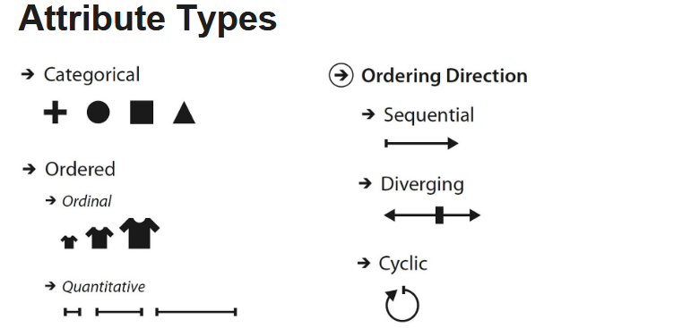
		- categorial(nominal) attributes
			- no implicit ordering (often hierachical)
			- external ordering can be superimposed
			- e.g. different types of fruits
		- Ordered attributes
			- ordinal data (e.g. t-shirt size)
			- quantitative (e.g. height, temperature or stock price)
		- Ordering directions
			- sequential: range max to min (e.g. mountain heights)
			- diverging (e.g. valleys in the sea and mountains on land)
			- cyclic (e.g. time measurements like the hour of the day or the day of the week)
		- Hierarchical attributes
			- hierarchical structures within or between multiple attributes
			- e.g. time series of daily stock prices where time can be aggregated hierarchically (from days to weeks, months and years)
	- Key vs value semantics
	  collapsed:: true
		- type of an attribute does not tell us about its semantics
		- key attributes (independent attribute) represents an index that is used to look up value attributes (dependant attributes)
			- key attributes can be categorical or ordinal
			- value attributes can be categorical, ordinal or quantitative
		- Flat tables
			- key might be implicit (simply the index of the row) or explicit (attribute within table with unique values)
		- Multidimensional tables
			- multiple keys are required to look up an item
			- combination of all keys must be unique for each item
		- Fields
			- independent variable to look up dependent variable
			- multivariate structure
				- **depends on number of value attributes**
				- scalar field: 1 attr/cell
				- vector field: 2+ attr/cell
				- tensor field: many attr/ cell
			- multidimensional structure
				- **depends on number of keys**
				- e.g. 2D or 3D fields
	- Temporal semantics
	  collapsed:: true
		- temporal attribute is any kind of information that is related to time
		- data about time is complicated to handle
			- time hierarchy is deeply multiscale (from nanoseconds to hour, decades to millennia)
			- temporal scales do not all fit into a strict hierarchy (e.g. weeks do not cleanly fit into months)
			- transformation and aggregation become complex
		- Time-varying semantics
			- time is one of the keys attributes (opposed to being a value)
			- time-series dataset
				- ordered sequence of time-values pairs
	- Task abstraction
	  collapsed:: true
		- next we have to investigate the why part of the what-why-how analysis framework
			- what is the goal of using the vis?
		- Transforms task description from domain-specific language into abstract form
			- enables reasoning about similarities
		- Who has the goal?
			- designer of the vis or the end user?
	- Actions (ASQ)
		- User goals can be defined by actions at three levels
			- analyse
				- consume existing or also produce additional data
			- search
				- what kind of search is involved (are the target and location known)?
			- query
				- need to identify one target, compare some targets or summarise all of the targets.
	- Analyse
		- consume (discover -> present -> enjoy)
		- produce (annotate -> record -> derive)
		- most common use case for vis is to consume information that has already been generated
	- Consume (DPE)
	  collapsed:: true
		- Discover (Explore)
			- use vis to find new knowledge that was not previously known
			- serendipitous observation of unexpected data
			- may be motivated by theories, models or hypotheses
			- outcome is to **generate a new hypothesis or verify (or disconfirm) an existing hypothesis**
			- need for sophisticated interactive vis idioms since we do not know in advance what the user will need to see
			- note that the why the vis is being used does not dictate the how
		- Present (Explain)
			- communication of information, telling a story with data or guiding au audience through a series of cognitive operations
			- output of a discover session might be become input for a present session
		- Enjoy
			- a casual encounter with vis (not driven by need to verify or generate a hypothesis)
	- Produce(ARD)
	  collapsed:: true
	  generate new material which is often immediately used as input for a next instance
		- Annotate
			- graphical or textual annotations of existing visualisation elements (might be stored as a new attribute)
			- typically a manual user action
		- Record
			- save or capture visualisation elements
			- screenshots, bookmarks, parameter settings or interaction logs
			- e.g. graphical history with a snapshot of the output of each task
		- Derive
			- produce new data elements based on existing data elements
			- strong relationship between the form of the data (attribute and dataset types) and the vis idioms that are effective at presenting it
			- derived attributes can be used to extend the dataset
				- from quantitative to ordinal data (water temp -> cold, warm or hot)
				- adding lat and lng to city name (via lookup in separate DB)
				- arithmetic operation on existing attributes
	- Targets
		- All data (TOF)
			- Trends
				- high-level characterisation of a pattern in the data (increases, decreases, peaks, plateaus)
			- Outliers
				- data that does not fit well with the backdrop
			- Features
				- task-dependent structures of interest
		- Attributes (SM)
			- single attributes (individual values, min or max)
			- multiple attributes (dependencies, correlation and similarities)
		- Network data
			- network topology as well as specific paths
		- Spatial data
			- understanding and comparing geometric shapes
	- Search (LLBE)
	  collapsed:: true
	  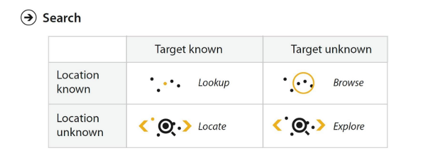
		- Lookup
		  user knows what they are looking for and where it is
		- locate
		  user knows what they are looking for but does not know where it is
		- Browse
		  user does not know exactly what they are looking for but has a location in mind where to look
		- Explore
		  **user does not know what they are looking for and where to search**, often beginning from an overview of everything
	- Query (ICS)
		- Identify
			- if the search returns **known targets (lookup or locate)** then identify return their **characteristics**
			- if the search **returns targets matching particular characteristics (browse or explore)** the identify returns **specific references**
		- Compare
		  comparing multiple targets, it is more difficult than identifying tasks and requires more complex vis idioms
		- Summarize (overview)
		  scope are all possible targets
- ## Lecture 4 (DATA representation)
  collapsed:: true
	- 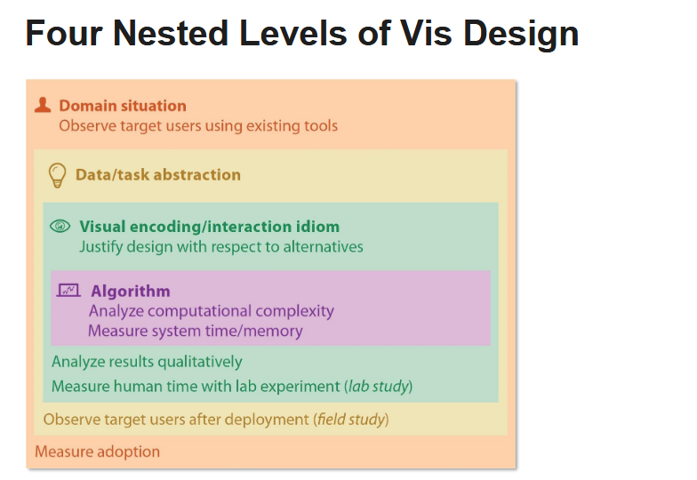
	- Validation
		- Huge vis design space and most designs are ineffective
		- Validate choices right from the beginning of the design process
			- top-down design (problem-driven work)
				- start at top situation domain level
				- major challenge at data/task abstraction; mainly use existing idioms
			- bottom-up design (technique-driven work)
				- inveniton of new idioms or algorithms
		- Independently validate all four levels of the design
			- domain validation
			- abstraction validation (what and why)
			- idiom validation (how)
			- algorithm validation
	- Four nested levels of Vis design (DAIA)
	  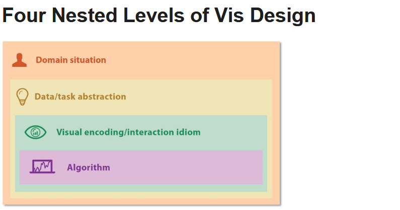
	  Output from upstream level is input to downstream level
		- errors from upstream levels propagate to downstream levels
		- highly iterative design problem
	- Domain Situation
		- A domain situation is defined by
			- target users
			- domain of interest of target users(each domain might have its own vocabulary)
			- data of target users
			- questions(tasks) of target users
		- Outcome of design process
			- understanding of user needs (user-centered design)
		- Challenges and risks
			- users can often not clearly specify their analysis needs
			- designers make assumptions (rather than engaging with users)
		- Data & Task Abstraction
			- Abstract from answers to domain-specific questions at upstream to a generic representation
				- questions from different domains situations can map to the same abstract vis task
					- e.g. browsing, comparing or summarising
				- Design abstract data
					- data from upstream is often transformed into something different
					- determine which data type supports a visual representation that address a user's problem
		- Visual Encoding & Interaction Idiom
			- Specific way (idiom) to create and manipulate the visual representation of abstract data
				- visual encoding idiom
					- create a "picture" out of the data (what do users see?)
				- interaction idiom
					- how do users change what they see?
			- Design space of the combination of visual encoding and interaction idioms is very large
				- data and task abstractions help to reduce the number of potential visual encoding and interaction idioms
				- decision about good or bad matches based on human abilities (visual perception and memory)
		- Algorithm
			- Implementation of visual encoding and interaction idioms
				- can design different algorithms to realise the same idiom
			- Various factors might impact the choice of a specific algorithm
				- computational complexity (performance)
				- memory usage
				- level of match with visual encoding idiom
			- Separate algorithm design (computational issues) from idiom design (human perception issues)
	- Threats to Validity
		- Each design level has their own threats to validity
			- wrong problem, wrong abstraction, wrong idiom or wrong algorithm
	- Validation approaches
		- Can perform an immediate or downstream validation
			- downstream dependencies add to the difficulty of validation
				- e.g. poor algorithm design may have a negative effect when validation an interaction technique
			- use of mock-ups for early downstream evaluation
		- Mismatches
			- mismatch between the level at which the benefit is claimed and the chosen validation methodology
				- e.g. benefit of new visual encoding idiom cannot be validated by measuring the performance of the algorithm used downstream
			- carefully select the subset of validation methods matching the levels of design where contributions are claimed
	- Domain validation
		- A field study can help to validate that we are going to address real user needs
			- **observe people in real-word settings**
			- interviews
		- Downstream validation can for example investigate a solution's adoption rate by the target audience
			- **see what target users do** (without bringing them into a lab)
	- Abstraction validation
		- identified task abstraction and data abstraction might not solve the target audience's problems
		- downstream validation includes testing the solution with members of the target audience
			- **qualitative feedback** whether the tool is **useful**
			- **field study to observe and document how the target audience** uses the tool in their **real-world workflow**
				- observe changes in behaviour rather than document existing work practices
	- Idiom validation
		- Justify the design of the idiom with respect to **known perceptual and cognitive principles**
		- Heuristic evaluation or expert revies may be used to ensure that **no known guidelines are violated**
		- Downstream validation
			- **lab study**
			- **presentation and qualitative discussion of results**
			- **quality metrics**
			- **usability studies**
	- Algorithm Validation
		- Analyse computation complexity of algorithms
		- Downstream validation
			- execution time
			- memory consumption
			- scalability
		- Correctness of algorithm
		- Standard benchmarks might help to compare algorithms
	- 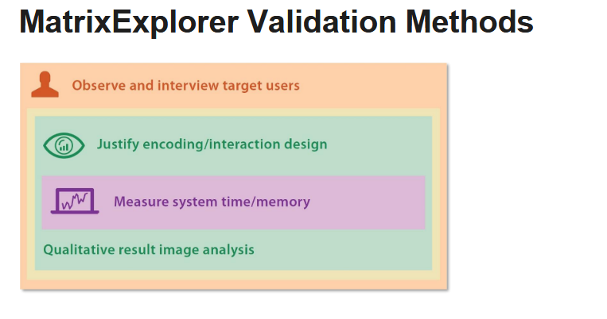
	- 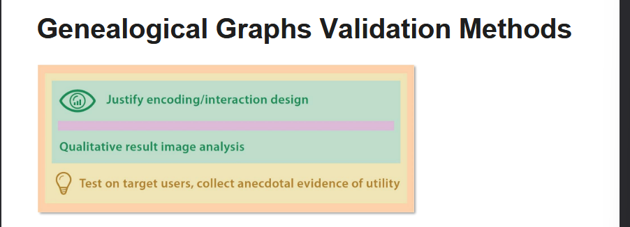
	- 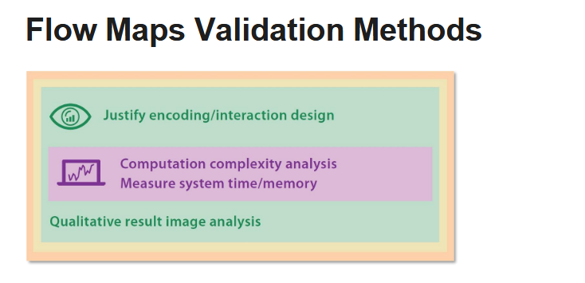
	- 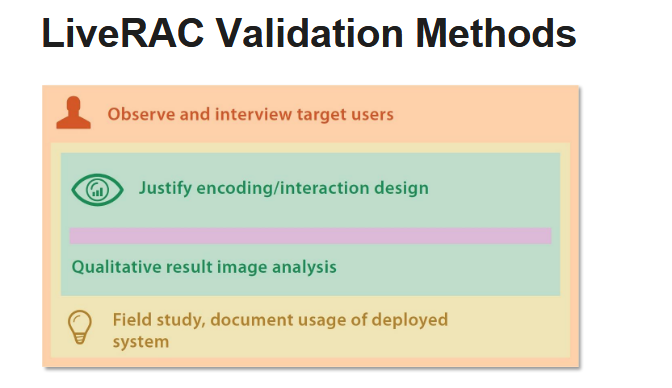
	-
- ## Lecture 5 (Data presentation)
  collapsed:: true
	- Marks and Channels
		- **Marks** are basic **graphical elements**(geometric primitives) to represent **items or links**
		- **Channels** control the **appearance of marks**
		- Vis design space described by orthogonal combination of marks and channels
		- complex visual encodings can be decomposed and analysed in terms of their marks and channels
	- Marks
	  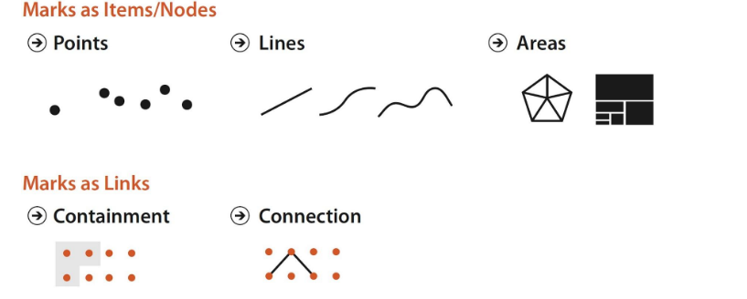
		- Basic geometric/graphical element in an image
		- Zero, one or two dimensional marks
			- three dimensional marks (volumes) are not used frequently due to limited perception
	- Mark types
		- **item marks**
		- **link marks**
			- **connection** marks (pairwise)
			- **containment** marks (enclosure or nesting)
	- Channels
	  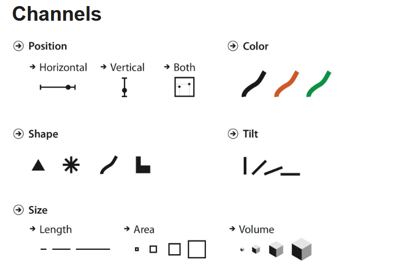
		- control appearance of mark independently of the dimensionality of the geometric primitive
		- Many visual channels
			- shape, spatial position, colour, motion, size, tilt
		- **Size and shape** channels cannot be used on all types of marks
			- e.g. area marks typically not size or shape coded
	- Channel types
		- identity channels
			- **information** about **what** something is
			- e.g. shape, hue channel, motion pattern
		- Magnitude channels
			- how much of something is there
			- e.g. size, luminance or saturation colour channels
	- Using marks and channels
		- Progression of chart types
		- In examples each attribute encoded vis single channel
			- multiple channels might also be used redundantly
		- Use of marks and channels guided by the **principles of expressiveness and effectiveness**
			- after identifying most important attributes ensure that they are encoded with the highest ranked channel
		- Expressiveness principle
			- visual encoding should express **all of, and only, the information in the dataset attributes**
				- ordered attr -> magnitude channels
				- unordered attr -> identity channels
		- Effectiveness principle
			- importance of attribute should match the salience(noticeable) of the channel
			- most important attributes encoded with most effective channel
		- Attributes encoded with position will dominate the user's mental model
			- choice of which attributes to encode with position is the most central choice in visual encoding
	- Channel effectiveness
		- quantify effectiveness via accuracy
			- how close is human perceptual judgement to some objective measurement of the stimulus?
		- Different visual channels are perceived with different levels of accuracy
			- characterised by steven's psychophysical power law
		- Channel effectiveness mainly based on accuracy but also takes into account (dspg)
			- discriminability
			- separability
			- popout
			- grouping
	- Steven's Psychophysical Power law : $S=I^N$
		- Responses to sensory experience of magnitude are characterisable by power laws
			- S = perceived sensation
			- I = physical intensity
			- exponent N depends on sensory modality
			- most stimuli are magnified (superlinear) or compressed (sublinear)
	- Error rates across channels
	  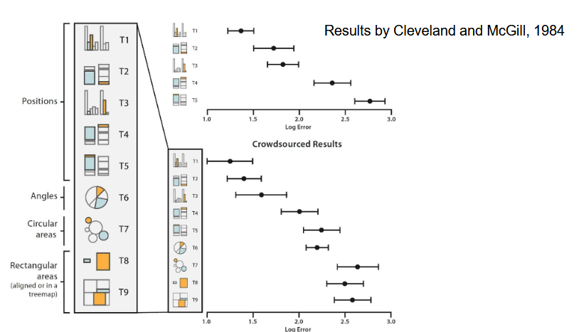
	- Discriminability
		- Quantify the number of distinguishable steps (bins) that are available within a visual channel
			- some channels (e.g. line width) have a very limited number of bins
			- small number of bins is not a problem if the number of values to be encoded is also small
			- number of different values that need to be shown for an attribute must not be greater than the available bins for the visual channel
	- Separability
		- Channels are not always completely independent from each other (interchannel interference)
			- ranging from fully separable channels to the inseparably combined integral channels (major interference)
		- Visual encoding straightforward with separable channels
			- encoding of different information in integral channels will fail
	- Popout
		- many channels provide visual popout where a distinct item stands out from many others immediately
		- most pairs of channels do not support popout
			- use popout for a single channel at a time
		- popout channels
			- tilt, size, shape, proximity, shadow direction
	- Grouping
		- Containment (links) is the strongest cue for grouping following by connection coming in second
		- items sharing the same level of a categorical attribute can also be perceived as a group
		- proximity is the third strongest grouping approach
		- similarity (hue, motion and shape)
			- shape and motion channel to be used with care
	- Relative versus absolute judgements
		- perceptual system fundamentally based on relative judgements and not absolute ones (webers's Law)
			- e.g. position along a scale can be perceived more accurately than pure length judgement without a scale
		- Perception of luminance is contextual based on the contrast with surrounding colours
	- Colour (Hue) Perception
	  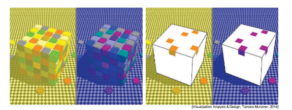
		- Our visual system evolved to provide colour constancy
			- same surface identifiable across illumination conditions
			- visual system might work against simple colour encodings
	- Mapping colour
		- Luminance and saturation are magnitude channels while hue is an identity channel
			- luminance can be used for two to four levels(bins)
			- saturation can be used for up to three levels (bins)
				- strongly interacts with size channel
			- saturation and hue are non-separable channels for small regions
	- comparing HSL lightness
		- computed HSL lightnss L is the smae for all six colours
			- true luminance as measured by an instrument
			- perceived luminance L* represents what we see
				- more sensitive to certain wavelengths (green and yellow) as shown earlier with spectral sensitivity
	- No implicit order for Hue
		- Sometimes learned hue order (not at perception level)
			- green-yellow-red from traffics lights
			- rainbows colour ordering
	- Colourmaps
		- A colourmap defines a mapping between colours and data values
		- Colourmaps can be categorical or ordered (sequential or diverging)
			- use magnitude channels of luminance and saturation for ordered data
	- Categorical colourmaps
		- Categorical colourmaps (qualitative colourmaps) are normally segmented (not continuous)
			- effective for categorical data (next best channel after position)
		- good resource for creating colourmaps is colorbrewer
		- Can use six to twelve distinguishable hue steps (bins) for small separated regions
			- includes background colour and default object colours
			- use easy nameable colours: e.g. red, blue, green, yellow, orange, brown, pink, magenta and cyan
		- use highly saturated colours for small regions
		- use low-saturation colours (pastels) for large regions
	- Ordered colourmaps
		- sequential colourmap ranges from a min value to a max value
			- use luminance or saturation channel
		- diverging colourmap
			- use two hues at the endpoints and a neutral colour as a midpoint
	- Rainbow vs two-hue colour map
		- how many hues to use in continuous colourmaps?
			- high-level structure vs local neighbourhoods
			- rainbow colourmap makes it easier to discuss specific subranges
	- Rainbow continuous colourmaps
		- problems of rainbow continuous colourmaps
			- hue is used to indicate order despite being an identity channel
			- scale is not perceptually linear
			- fine details cannot be perceived via the hue channel
				- luminance better
			- the 3 problems of rainbow continuous colourmaps can be addressed by using monotonically increasing luminance colourmaps
				- multiple hues are ordered according to their luminance from lowest to highest
			- rainbow colourmap
			  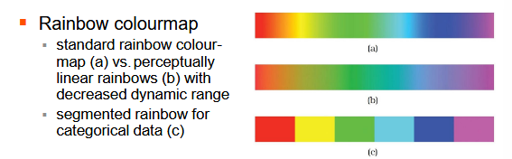
	- Bivariate colourmaps
		- safest use of colour channel is to visually encoe a single attribute (univariatie)
		- in the colourmap categorisation we have seen colour maps encoding two separate attribute (bivariate)
			- if one of the two attributes is binary then it is straightforward to create a comprehensible bivariate colour colourmap
				- choose base set of hues and vary the saturation
			- if both attributes are categorical with multiple levels the results will be poor
			- combinations of sequential and diverging attributes should be used carefully
				- appear frequently in vis solutions but some people have difficulties to interpret their meaning
	- Colourblind-safe colourmaps
		- A safe strategy is to avoid using the hue channel only
			- e.g. vary luminance or saturation in addition to hue in categorical colourmaps
		- Avoid colourmaps emphasising red-green
		- Use colour blindness simulators and tools such as Viz Palette
	- Size channels
		- Suitable for ordered data but interacts with most other channels
			- length (1D): judgment of length is very accurate
			- area (2D): judgement of area is less accurate
			- volume (3D): volume channel is quite inaccurate
	- Tilt/Angle channel
		- encode magnitude information based on the orientation of a mark
			- tilt: against global frame
			- angle: line with respect to another line
		- Accuracy of our perception of a tilt/angle is not uniform
			- very accurate near exact horizontal, vertical or diagonal positions
	- Other channels
		- Shape channel
			- commonly applied to point marks
			- can also be applied to line marks
		- Motion channels
			- direction of motion
			- velocity of motion
			- flicker and blinking frequency
			- very separable from all other static channels
		- Texture and stippling channel
			- texture can be simplified by considering it as a combination of the following 3 perceptual dimensions
				- orientation, scale and contrast
			- texture can be used to show categorical attributes as well as ordered attributes
			- stippling fills regions of drawing with short strokes (dashed or dotted lines)
- ## Lecture 9
	- View manipulation
		- Why to manipulate and change the view?
			- dataset might be too large to show everything at once
				- reduce complexity of single view
			- single static view might lead to visual clutter
		- How to manipulate/change a view over time?
			- select specific elements (items or attributes)
			- reordering (sorting) of items
				- find pattern by ordering based on different attributes
				- change parameters of a particular idiom
					- range of possible mark sizes
			- semantic zooming
			- switch between idioms
	- Change between Visual encoding idioms
	- line up example with reordering
		- Slope graphs (bump charts) with connecting line marks linking the same items together
	- LineUp
		- What(Data) Table.
		- What(Derived) Ordered attribute: weighted combination of selected attributes.
		- Why(Task) Compare rankings, distributions.
		- How (Encode) Stacked bar charts, slope graphs.
		- How (Manipulate) Reorder, realign, animated transitions
	- Animated transitions example
		- maintain a sense of context between states
		- what: compound network
		- how: change with animated transition. Navigation between aggregation levels
	- Element Selection
		- Different design choices for element selection
			- Which element can be selection targets?
				- data items, links, data attributes, levels within a data attribute,....
			- one kind of selection vs. multiple kinds of selection (e.g. via hover)
				- multiple mouse buttons or combination  with key presses for more advanced types of selections
			- selection of single elements vs selection of many elements
			- selection of primary and secondary target
				- e.g. for path traversal from source to target in a direct graph
			- selection often defines the target of a next action
	- Selection Highlighing
		- provide immediate visual feedback to users about element selection
			- different possibilities for highlighting of data items
				- changing colour
				- outline
				- change size
				- slightly moving items/pattern
			- different possibilities for highlighting link mark
				- changing colour
				- change linewidth, shape
			- multiple highlighting design choices can be combined
			- selected items might be connect via explicit visual links (connection marks)
	- Context-preserving visual links
		- what: any data
		- how: any encoding, highlight with link mark
		- how: select any element
		- how: juxtaposed multiple views