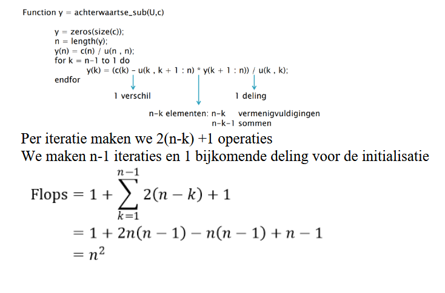
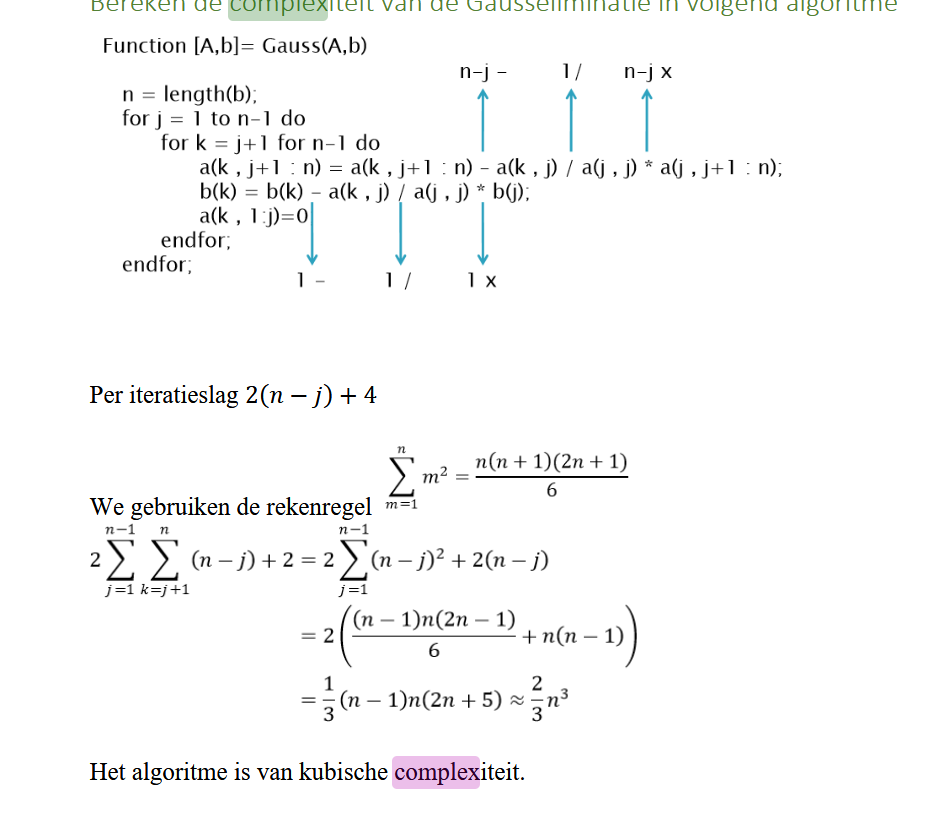
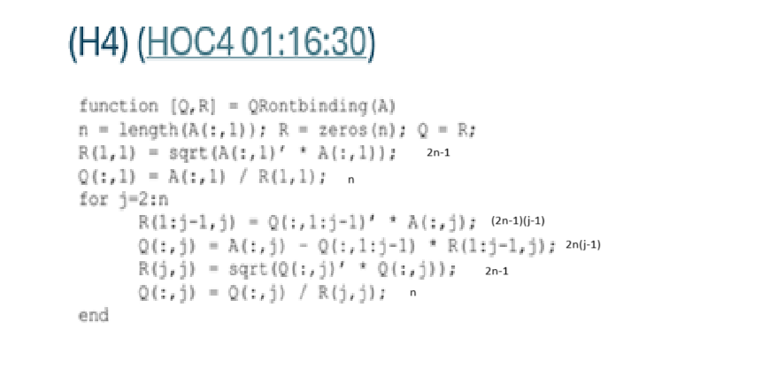

### Formuleer de 64-bit IEEE standaard voor floating point getallen en bereken de computerprecisie.
	- De 64 bit IEEE standaard voor floating point of beter gekend als de "double" maakt gebruikt van 64 bits waarvan 53 mantisse and 11 bit exponent.
	- We gebruiken de standaard om floating getallen voor te stellen als volgt: 
	  $$fl(x) = \pm i_0.i_1....i_p \times 2^e$$
	  Het teken heeft ook 1 bit nodig voor zowel de mantisse als exponent.
	- Het grootste getal is: 
	  $$1.1.....1 \times 2^{1111....1} \approx O(10^{308})$$
	- Het kleinste getal is:
	  $$1.0 \times 2^{-111...1111} \approx O(10^{-308})$$
	- 2e getal na nul:
	   $$0.00...1 \times 2^0 = 2^{-52} \approx O(10^{-16})$$
	- $\Rightarrow$ Double systeem rekent men met 15 cijfers maximaal
- ### Bewijs en formuleer de stelling van Sterbenz. Wat bedoelt deze precies?
	- Zij $x = fl(x)$ en $y = fl(y)$ en $\frac{y}{2} \leq x \leq 2y$ dan geldt $x - y = fl(x-y)$
	- De stelling laat vooral zien dat precisieverlies optreedt bij het aftrekking van 2 niet FP getallen. Eens we alleen FP getallen gebruiken dient men alleen de voorwaarde van Sterbenz te respecteren. De getallen worden opnieuw geordent zodat deze voorwaarde gerespecteerd wordt.
	- **Bewijs**
		- Beshouw een systeem met precisie p in basis 10 en stel
		  $$y = i_0,i_1i_2...i_p \times 10^e$$
		  $$x = j_0,j_1j_2...j_p \times 10^e$$
		  Zonder verlies aan algemeenheid stellen we dat $y \leq x$.
		- We berekenen het verschil $x-y$:
		  $$x-y = ( j_0,j_1j_2...j_p \times 10^{d-e} - i_0,i_1i_2...i_p ) \times 10^e  $$
		- Is $j_0,j_1j_2...j_p \times 10^{d-e} - i_0,i_1i_2...i_p$ een mantisse met precisie p
		  $$x - 2y \leq 0$$
		  $$\Rightarrow x - y \leq y$$
		  $$\Rightarrow  (x-y)10^{-e} \leq y 10^{-e}$$
		  $$\Leftrightarrow j_0,j_1j_2...j_p \times 10^{d-e} - i_0,i_1i_2...i_p \leq  i_0,i_1i_2...i_p $$
		- De macht van 10 is positief maar vraag niet een extra cijfer zodat p cijfers voldoende zijn. Om de verschil uit te drukken hebben we maximaal p cijfers nodig
		  Stelling van Sterbenz duidt aan dat het rekenen met machinegetallen minder gevoelig is dan niet rekenen met niet-machine getallen.
- ### Hoe definieer je de conditionering en conditiegetal? Wat stelt dit getal precies voor?
	- De conditionering onderstelt de numerieke bewerkingen als perfect, maar **bestudeert de invloed van een invoerfout of pertubatie**. Dit is een afrondfout analyse. Hoe propageert de **initiele afrondingfout zich naar het eindresultaat**. Hoe rekengevoelig is het eindresultaat ten gevolgen van fouten aan de start.
	- Stel dat we de functie $F(x)$ willen evalueren met invoer $x \in \mathbb{R}$. Aangezien de invoer een afrondfout heeft beschouwen we dit eerste orde analyse
	  $$F(fl(x)) = F(x+\Delta x) \approx F(x) + F'(x) \cdot \Delta x$$
	  De relatieve fout is nu 
	  $$\delta F(fl(x)) = \frac{F'(x)}{F(x)} \Delta x =  \frac{xF'(x)}{F(x)} \delta x$$
	  Het conditiegetal $\gamma(x) = \frac{xF'(x)}{F(x)}$
	- He conditiegetal van een functie met een argument meet **hoeveel de output waarde van de functie kan veranderen voor een kleine wijzinging als input argument**.
	- 1000 = conditiegetal 
	  je mag verwachten dat je 3 bijhorende cijfers nog extra zal verliezen
	  hoe hoger hoe numberiek gevoeliger
- ### Leg het verschil uit tussen sterke en zwakke numerieke stabiliteit.
	- Een algoritme is sterk stabiel als haar **relatieve fout vergelijkbaar is met de machineprecisie**. Door stabilisatie brengt men een zwak stabiel dichter bij een sterk stabiel algoritme.
	-
	- Een algoritme is zwak stabiel als haar onvermijdelijke fout vergelijkbaar is met de conditionering van het probleem. Dus relatieve fout is vergelijkbaar met de conditiegetal $\times$ machineprecisie
	-
- ### Formuleer een numeriek stabiele methode voor het berekenen van de functie $f(x) = \frac{1}{1+2x} - \frac{1-x}{1+x}$ voor $x \approx 0$. Leg uit waarom in de buurt van $x \approx 0$ er een numeriek probleem optreedt. Is het probleem in de buurt van $x \approx 0$ goed geconditioneerd?
	-
- ### Bereken de complexiteit van de achterwaartse substitutie in volgend algoritme:
	- 
	- 1
	- $$1 + \sum_{k=1}^{n-1} 2(n-k) + 1 $$
	  $$=1+ 2n(n-1) - n(n-1) + n-1$$
	  $$= n^2$$b
	-
- ### Bereken de complexiteit van de Gausseliminatie in volgendalgoritme:
	- 
	-
	-
	- $$\sum \sum 2(n-j) + 4$$
	  $$2 \sum \sum (n-j) + 2$$
	  $$2 \sum (n-j)^2 + 2(n-j)$$
	  $$\approx \frac{2}{3}n^3$$
- ### Bereken de complexiteit van de QR-ontbinding in volgende algoritme:
	- 
	- 2n-1 (n \times en n-1 +)
	- n (n \div)
	- =3n - 1
	- $\Sigma$
	- (2n-1)(j-1)
	- 2n(j-1)
	- 2n-1
	- n
	- $$3n - 1 + \sum_{j=2}^n (4n-1)(j-1) + 3n - 1$$
	  $$3n - 1 + \sum_{j=2}^n 4nj - n - j $$
	  $$3n - 1 + 4n(\frac{n(n+1)}{2}) + \sum_{j=2}^n- n - j$$
	  $$3n - 1 + 2n(n^2+n) + \sum_{j=2}^n- n - j$$
	  $$3n - 1 + 2n((n+1)) + \sum_{j=2}^n- n - j$$
- ### Bewijs de uniciteit van de LU-decompositie.
	- Stelsel van Crout heeft hoogstens 1 oplossing
	- LU-decompositie zijn voor beide driehoekige matrices. Aantal in te vullen plaatsen is dus: $n + (n-1) ... +1 = \frac{n(n+1)}{2}$
	- Voor één van de matrices is de diagonaal vast gekozen met overal 1. Dus is er slechts $\frac{n(n+1)}{2} - n = \frac{n(n-1)}{2}$ plaatsen te kiezen.
	- Voor de matrices U en L samen levert dit $\frac{n(n-1)}{2} + \frac{n(n+1)}{2} = n^2$ keuzes.
	- Er is dus ten hoogstens 1 LU decompositie. Het algoritme van crout laat zien dat een procedé bestaat zodat LU decompositie uniek is.
- ### Bewijs de uniciteit van de QR-decompositie
	- We weten dat $A=QR$ een niet linear stelsel is. We moeten nagaan hoeveel onbekenden en hoeveel vergelijkingen we exact hebben. Aangezien R een bovendriehoeksmatrix is hebben we dus $\frac{n(n+1)}{2}$ onbekenden
	  logseq.order-list-type:: number
	- Aan gezien $Q'Q = 1$ vinden we dat 
	  logseq.order-list-type:: number
	  $[Q^T Q]_{uv} = \begin{cases} 1 & \text{als } u = v \\ 0 & \text{anders} \end{cases}$
	  Dit levert $\frac{n(n-1)}{2}$ vergelijkingen op die nul moeten worden en N die 1 moeten worden. De matrix Q heeft 
	  $n^2 - \frac{n(n-1)}{2} - n = \frac{n(n-1)}{2}$ onbekenden
	  Samen zijn er dus $n^2$ onbekenden wat de stelling bewijs.
- ## Leg het principe re-orthogonalisatie uit
	- Re-orthogonalisatie past men toe in de QR-ontbinding wanneer er een gebrek is aan stabiliteit.
	  Er werd aangetoond dat deze aanpak leidt tot een sterk stabiel algoritme, zelfs na beperkt
	  aantal iteraties. (rounding error analysis of the classical gram-schmidt orthogonalization
	  process)
	- #### Verklaar waarom deze stap zonder afrondsfouten overbodig is
		- In de paper rond round-off error analysis of the gram-schmidt algorithm with reorthogonalization wordt vermeld dat voor welgevormde matrices zonder afrondfouten de berekende vectoren heel dicht liggen bij machine precisie en de reorthogonalisatie overbodig
		  is, maar bij ill-conditioned matrices de uiteindelijke fout veel groter is. Een toepassing van 2
		  iteraties volstaat om stabiel te zien.
-